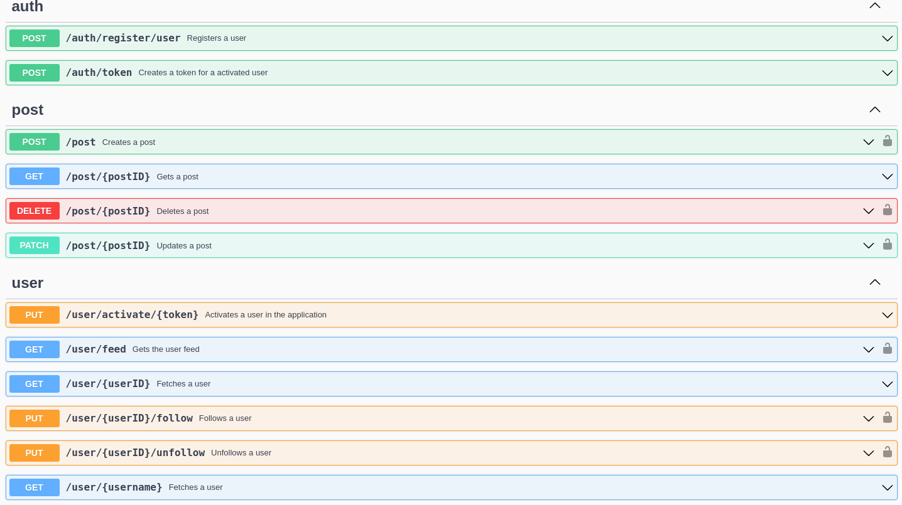

# Sapphire-backend

Golang backend for a social media application.

# Key features

- **Clean Architecture**: organized with layers (HTTP handler -> service -> store)
- Redis **caching**
- Automated API **documentation** with Swagger
- **Email** notification to new users confirm account creation
- Integration and unit **tests** with Testcontainers
- **Rate limiter** to protect the application from excessive requests

# Technologies used

- [Postgres](https://github.com/lib/pq) for database
- [Redis](https://github.com/redis/go-redis) for caching
- [Chi](https://github.com/go-chi/chi) for routing
- [JWT](https://github.com/golang-jwt/jwt) for authentication
- [Swagger](https://github.com/swaggo/swag) for API documentation
- [Zap](https://github.com/uber-go/zap) for logging
- [Go-mail](https://github.com/wneessen/go-mail) for e-mail sending
- [Testify](https://github.com/stretchr/testify) for mocks and unit tests
- [Testcontainers](https://github.com/testcontainers/testcontainers-go) for unit and integration tests

# Dependencies

To run this application locally you need to have:

- Docker
- [Air](https://github.com/air-verse/air): go live-reloading tool

# Running

- Start database:

```sh
docker compose up --build
```

<!---
-   Run migrations (You need to have [migrate](https://github.com/golang-migrate/migrate) installed as a CLI:

```sh
make migrate-up
```
-->

- Seed the database:

```sh
go run cmd/seed/main.go
```

- Start application with [air](https://github.com/air-verse/air) (need to be installed as a CLI)

```sh
air
```

# Docs

After the application starts, the documentation is available at `/v1/swagger/index.html`


